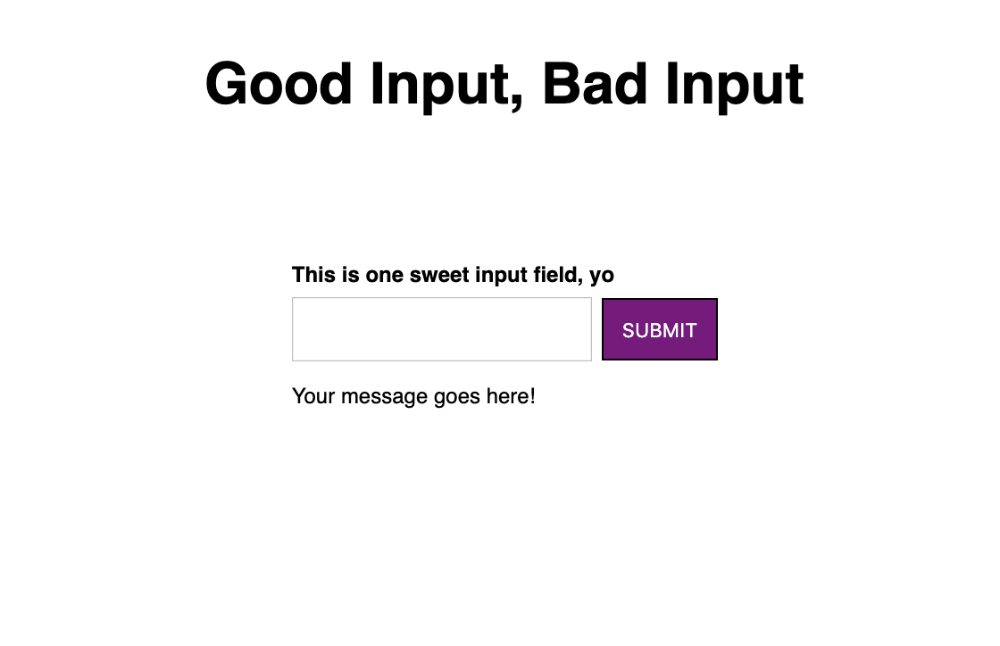

# Good Input, Bad Input

|                     |                                                                           |
| ------------------- | ------------------------------------------------------------------------- |
| **Difficulty**      | Easy / Intermediate                                                       |
| **Completion Time** | ~20-25 minutes for the base exercise, and 5-10 minutes for bonus features |
| **Interview Slot**  | On-site Interview, Angular (Javascript)                                   |

> Given the base component with an input field and button, add functionality that validates an input field on submission.
>
> A valid input contains "good" within the value:
> e.g. "good vibes only", "goodness", etc.
> An invalid input contains the word "bad" within the value:
> e.g. "too bad", "badminton", etc.
>
> 

## Setup Code (Codesandbox or Stackblitz is highly recommended for this set-up)

app.component.ts

```typescript
import { Component } from "@angular/core";

@Component({
  selector: "my-app",
  template: `
    <div class="App">
      <h1>Good Input, Bad Input</h1>
      <app-good-bad-input
        class="center"
        defaultValue="good to meet you"
      ></app-good-bad-input>
    </div>
  `,
  styleUrls: ["./app.component.css"],
})
export class AppComponent {}
```

app.component.css

```css
.App {
  display: flex;
  flex-direction: column;
  font-family: sans-serif;
}

.center {
  align-self: center;
  display: flex;
  flex-direction: column;
}

h1 {
  padding-bottom: 60px;
  text-align: center;
}
```

app.module.ts

```typescript
import { NgModule } from "@angular/core";
import { BrowserModule } from "@angular/platform-browser";
import { FormsModule, ReactiveFormsModule } from "@angular/forms";

import { AppComponent } from "./app.component";
import { GoodBadInputComponent } from "./good-bad-input/good-bad-input.component";

@NgModule({
  imports: [BrowserModule, FormsModule, ReactiveFormsModule],
  declarations: [AppComponent, GoodBadInputComponent],
  bootstrap: [AppComponent],
})
export class AppModule {}
```

good-bad-input/good-bad-input.component.ts

```typescript
import { Component, Input } from "@angular/core";

@Component({
  selector: "app-good-bad-input",
  template: `
    <label>This is one sweet input field, yo</label>
    <div>
      <input />
      <button>submit</button>
    </div>
    <p>Your message goes here!</p>
  `,
  styleUrls: ["./good-bad-input.component.css"],
})
export class GoodBadInputComponent {
  @Input() defaultValue?: string;
}
```

good-bad-input/good-bad-input.component.css

```css
input {
  padding: 10px 20px;
}

label {
  font-size: 12px;
  font-weight: 600;
  padding-bottom: 5px;
}

p {
  font-size: 12px;
  padding-bottom: 20px;
}

button {
  background-color: purple;
  border: 1px solid black;
  color: white;
  margin-left: 5px;
  padding: 10px;
  text-transform: uppercase;
}
```

## Requirements

- A valid input will display: "Good job! This is valid."
- An invalid input will display: "This is really, really bad."
- An input that does not contain "good" or "bad" will be neutral -- there will be no message displayed.
- The initial message passed in from the parent component must be displayed on page load.

## Bonus Features

If the candidate finishes early, try asking them to do the following:

- make the messages color-coded for their validity (red for invalid, green for valid)
- add a clear button that clears the input field
- make the input field validate as a user is typing

## What We're Testing

- Angular knowledge - the ability to use property binding, display content dynamically
- A little logic (validating a string)
- Event subscription - handling the `(click)` event for the validation, the `[(ngModel)]` binding for value updating
- ES6 knowledge (spread operator, destructuring)

## Solution

good-bad-input/good-bad-input.component.ts

```typescript
import { Component, Input, ChangeDetectionStrategy } from "@angular/core";

const isGood = (val) => val.indexOf("good") > -1;

const isBad = (val) => val.indexOf("bad") > -1;

type States = "neutral" | "good" | "bad";

@Component({
  selector: "app-good-bad-input",
  template: `
    <label>This is one sweet input field, yo</label>
    <div>
      <input [(ngModel)]="defaultValue" />
      <button (click)="validateField(defaultValue)">submit</button>
    </div>
    <p>{{ messageMap[validity] }}</p>
  `,
  styleUrls: ["./good-bad-input.component.css"],
  changeDetection: ChangeDetectionStrategy.OnPush
})
export class GoodBadInputComponent {
  @Input() defaultValue?: string;

  validity: States = "neutral";

  readonly messageMap = {
    good: "Good job! This is valid.",
    bad: "This is really, really bad.",
    neutral: ""
  };

  validateField(val: string): void {
    let validity: States = "neutral";

    if (isGood(val)) {
      validity = "good";
    } else if (isBad(val)) {
      validity = "bad";
    }

    this.validity = validity;
  }
}

```

## Evaluation Criteria

_Regular_

- Is able to complete most of the exercise with some help / guidance
- Communicates throughout the process, asks questions if stuck or asks to look at documentation if needed
- Is able to open the console and debug problems

_Senior+_
- Asks about constraints or requirements before starting / details and communicates how they will approach the problem
- Is able to complete the exercise with minimal or no hints
- Is able to complete one of the bonus features

_Nice to have:_

- knowledge of NgRx and reactive forms
