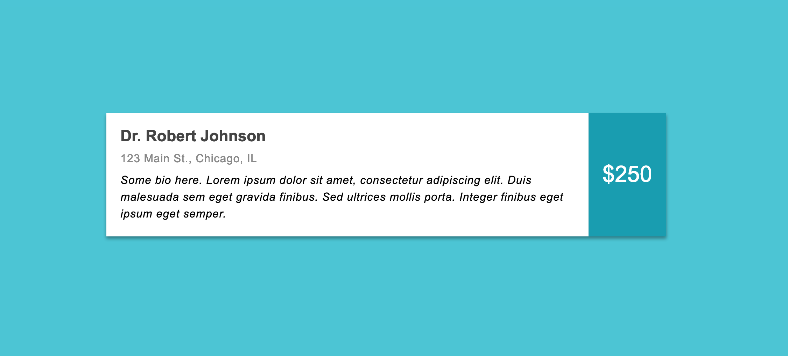
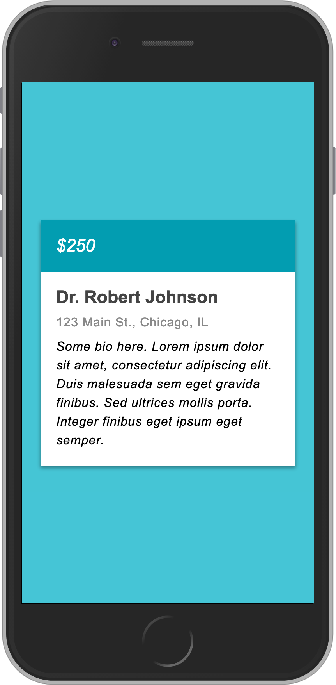

# Provider Information Card

| | |
|-|-|
| **Difficulty** |Medium|
| **Completion Time** |30-40 minutes|
| **Interview Slot** |CSS and HTML|

>Imagine your company lets users search for medical providers of a certain service. The search results are returned in the form of a provider information card. You are given the following mockups and specifications for the card from the design team.
>  
>Desktop mockup (https://i.imgur.com/ATb1FWD.jpg)
>  
>
>  
>  
>  
>Mobile mockup (https://i.imgur.com/eE2UniP.jpg)
> 
> 
>  
>Content:
>Dr. Robert Johnson
>    
>123 Main St., Chicago, IL
>  
>Lorem ipsum dolor sit amet, consectetur adipiscing elit. Maecenas et fermentum est. Phasellus porttitor sagittis nisl, ut porta mauris mattis sed. Suspendisse tempus vel nibh ac ultrices. Maecenas eget nibh non magna vehicula scelerisque eget a erat.
>  
>Font: Arial
>Mobile breakpoint: 450px
>Max element width: 750px
>  
>Your task is to code a css/html file that meets the above requirements.


## Interviewer Notes

* Try to use a collaborative tool like JSFiddle, or at least do a screen share. The candidate should be able to render their work as they go, and ideally you should be able to see the results.

* The candidate can use whatever css approach they want: Sass, vanilla css, etc.

* If the candidate asks about the specific colors, font weights, etc., tell them to use whatever tools they can to make a best guess. The general idea is they are given only the information above and need to come up with their best approximation.

* If they need explicit guidance, it's okay to direct them to dev tools and things like color picking, but more senior candidates should hopefully be familiar with that already. Worst case, the candidate can just assume a basic color (e.g., blue) and use that.

* If they ask about using em, rem, or px, tell them that using their preference is fine, but px throughout is okay (since the question specs are given in px). Then consider asking the followup question about units (see Follow-up Questions, below).

* If they want to look something up online (e.g., the details of a certain css property in flexbox), that is totally fine. One approach is to offer to "be their google" -- so they ask you what to look up, then you can do so and tell them the info. That way you know exactly what they needed help with, and what info they have to work with. At the very least, have them tell you what they are looking up if they do so themselves.

## What We're Testing

* Basic CSS and HTML knowledge
* Approach to responsive design
* Attention to styling details
* Familarity with developer tools
* Comfort with building from design mocks

## Solutions

There are many possible solutions, depending on the basic css approach, responsive design method, etc. Here is just one sample to give a sense of something you might see. Note that this would be considered a pretty strong solution.

```html
<div class="provider-card">
  <div class="main-content">
      <h1>Dr. Robert Johnson</h1>
      <div class="address">
        123 Main St., Chicago, IL
      </div>
      <div class="bio">
        Lorem ipsum dolor sit amet, consectetur adipiscing elit. Maecenas et fermentum est. Phasellus porttitor sagittis nisl, ut porta mauris mattis sed. Suspendisse tempus vel nibh ac ultrices. Maecenas eget nibh non magna vehicula scelerisque eget a erat.
      </div>
  </div>
  <div class="price">$250</div>
</div>
```

```css
body {
  background: #44c5d5;
  font-family: Arial, sans-serif;
  padding: 20px;
  display: flex;
  justify-content: center;
  align-items: center;
}

.provider-card {
  background: #fff;
  display: flex;
  flex-direction: column-reverse;
  max-width: 750px;
  box-shadow: 0 3px 6px rgba(0,0,0,0.16), 0 3px 6px rgba(0,0,0,0.23);
  .main-content {
    padding: 18px 20px;
    flex: 1 1 auto;
    font-size: 15px;
    h1 {
      color: #444;
      font-size: 1.4em;
      margin: 0; // header tags have margins applied by default
    }
    .address {
      margin-top: 8px;
      color: #888;
      letter-spacing: 0.04em;
    }
    .bio {
      margin-top: 8px;
      font-style: italic;
      line-height: 1.5em;
      color: #000;
    }
  }
  .price {
    background: #029db1;
    color: #fff;
    font-size: 1.3em;
    font-style: italic;
    padding: 20px;
    flex: 0 0 auto;
    display: flex;
    justify-content: flex-start;
    align-items: center;
  }
}

@media (min-width: 450px) {
  .provider-card {
    flex-direction: row;
    .price {
      font-size: 1.6em;
      font-style: initial;
      justify-content: center;
    }
  }
}
```

## Follow-up Questions

The basic question can take the entire css/html slot in many cases, so it's not expected that you would get to ask follow-up questions. But if time allows, here are some additional questions to consider, in no particular order:

1. If the candidate asked about using px versus em or rem in the initial exercise, ask them for further thoughts. 

    > Earlier you asked about pixels as opposed to using em or rem. If the choice were left entirely to you, which approach would you use and why? 

1. Ask about their experiences working with designers.

    > How much experience do you have working with design teams?
    > Can you give an example of a case where you where given a design and pushed back on it?
    > If you were given this design and had the chance to offer suggestions for changes, what, if anything, would you suggest?

1. Ask about adding their design to a component library.

    > If you were tasked with making the Information Card you just built a component to go into a company-wide component library, how would you change your approach?

    Answers can range from simpler things like "Pull colors out to be variables" to more complex things like using css utility classes or turning their initial design into a formal React (or other framework) component that takes some appropriate props as input.

1. Ask about cross-browser testing.

    > How would you make sure your code works across all browsers, including Internet Explorer?

1. Ask about accessibility.

    > Are you familiar with accessibility standards? If so, what sort of things would you take into consideration for your design?

    This exercise is not meant specifically to test accessibility, but you can still incorporate things like semantic markup (as opposed to basic divs and spans) and raise issues like color contrast in the given design. If nothing else it's a chance to gauge their past experience designing with accessibility in mind.

1. If their initial answer does not use any semantic HTML, ask about their familiarity with it and how they might change their answer to use it.

    > Are you familiar with semantic HTML? How might you change your original answer to use it?

1. Add or change some of the design specifications.

    > Suppose design comes back and says they want you to round the corners of the business card?

    Note for the above that they should round just the outermost edges of the card, so this might not be quite as simple as it seems at first. But feel free to throw any other (reasonable) design changes you can think of (e.g., adding on-hover behavior); the above is just an example.

## Evaluation Criteria

- They were able to approximate the mocks (the more senior the role, the closer the approximation).
- Asked some thoughtful questions and considered some potential issues before just diving into the code.
- Was able to use built-in browser tools to get exact color matches from the mocks.
- Used a more modern, standard approach to make their layout responsive, like flex or grid, as opposed to doing something like hard-coding widths or needing to import bootstrap.
- Organized their CSS in a logical, clear way.
- Followed best practices with their CSS (e.g., including a generic when specifying font-family). In particular, exhibiting a true mobile-first approach to their CSS (start with mobile sizes as the default, and treat desktop as the special media-tag case) is often a sign of more senior-level experience.
- Organized their HTML in a logical, clear way.
- Used (or at least demonstrated some familiarity with using) semantic HTML, like <article> or <section> tags, instead of basic <div>s.
- Had a reliable go-to way for centering the card both vertically and horizontally (better: flex, a combination of absolute/relative position, CSS translations; worse: table structure).
- Captured most of the following design details, especially the bigger-deal ones (e.g., missing the drop shadow isn't a deal breaker):
    * The mobile breakpoint should happen at 450px.
    * The max-width of the business card is 750px.
    * The font should be Arial.
    * The price is italicized in the mobile mock, but not the web one.
    * The fonts are bigger in the web mock than the mobile one.
    * The price text is vertically centered and left-justified in the mobile mock, but both horizontally and vertically centered in the web mock.
    * The non-price text is vertically centered and left-justified in both mocks.
    * The price section of the business card takes up less space on the card as a whole in the mobile mock than in the web mock.
    * The provider name/header text color is not quite black, but instead a very dark grey.
    * The bio text has an increased line-height.
    * The address has an increased letter-spacing.
    * The whole card has a slight drop shadow.
