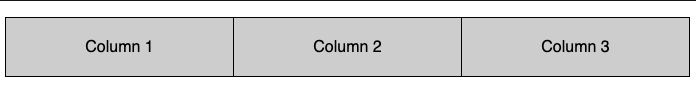

# Three Column Layout

| | |
|-|-|
| **Difficulty** |Easy|
| **Completion Time** |10-15 minutes for the basic question, up to 30 minutes for followups|
| **Interview Slot** |Tech Screen, CSS|

>Style the unordered list below to form equally-spaced columns that span the width of any given container. Your answer should be able handle adding or removing columns without having to update your css.

```html
<ul>
    <li>Column 1</li>
    <li>Column 2</li>
    <li>Column 3</li>
</ul>
```

>The end result should look this this: https://imgur.com/a/mEaqwHh


## Interviewer Notes

* If you want to use this question for the CSS portion of a tech screen, then you probably should limit your expectations to the basic question plus the first followup. Strong candidates might get to more followup questions, but those are intended more to round out full CSS interview slots as needed. Some of the followup questions are also a bit harder in terms of difficulty level, so don't feel like you have to do them in the order listed.

* Try to use an online collaborative tool or at least have the candidate do a screen share. The candidate should be able to render their work as they go, and ideally both of you should be able to see the results.

* The candidate should be able to do this with vanilla CSS. Frameworks like Bootstrap are not allowed for this problem.

* Candidates are not expected to have memorized all the relevant CSS properties. E.g., it's fine if they need to look up exact flex details, and certainly fine if they need to look up something like the property that removes bullet points from a list. Ideally any lookups should be pretty fast; the hope is that they have familiarity and just need to remember something specific. If they need to, say, look up how Flexbox as a whole works writ large, that's a problem.

## What We're Testing

* Basic knowledge of responsive design and other CSS features.
* Ability to design from a basic mock.

## Solutions

The best solutions will use modern CSS approaches like Flexbox or Grid. Here is a sample solution using Flexbox properties, with some comments.

```css
ul {
    display: flex;
    /* flex-direction defaults to row, so it's okay if a candidate leaves this out. */
    flex-direction: row;
    /* space-between is also okay here; if the candidate asks, tell them it's their choice. */
    justify-content: space-around;
    /* This removes the bullet points from each li item. */
    list-style-type: none;
    /* This removes the left-padding added from the ul.
    Candidates are not expected to know/do this, but bonus points if they do, or use a dev tool inspector to figure it out. This is included here just for the sake of completeness. */
    padding-inline-start: 0px;
}

li {
    /* The exact color doesn't matter, we're not expecting candidates to use a color picker tool for this exercise, though bonus points if they do. */
    background-color: lightgray;
    /* Candidates are not expected to get the exact padding for this exercise, but they should know to add some and be able to get something decent-looking by eye-balling. */
    padding: 20px;
    text-align: center;
    /* This makes the columns occupy their full width, and seems to be a common gotcha point. */
    width: 100%;
}
```

You might also see approaches like this:
```css
ul {
  display: inline-block;
  width: 100%
}

li {
  float: left;
  width: 33%;
}
```

This sort of answer requires changing the `width` value if the number of columns changes. So it's worth following up to ask how they would deal with an unknown number of `li` elements. How would they handle not being able to hard-code width? If they suggest doing something with `display: table-cell`, ask if this is an appropriate use of a table structure (hint: it isn't).


## Follow-up Questions

1. Ask the candidate to make the layout change to stacked columns below a certain width.

    > What you have looks good. Can you please update your CSS so that below 500px the columns change to be vertically stacked instead of in a row? 

    Using a media tag is the standard answer. Bonus points for a true mobile-first answer that flips the `flex-direction` on the `ul` element to be `column` and then adds a media-tag like so:
    ```css
    @media screen and (min-width: 500px) {
        ul {
            flex-direction: row;
        }
    }
    ```

    But an answer like this will also work:
    ```css
    @media screen and (max-width: 500px) {
        ul {
            flex-direction: column;
        }
    }
    ```


2. Ask the candidate to add a border around the columns.

    > Can you please add borders to your columns, so it looks like this: https://imgur.com/a/VooKiEp
    

    There are a lot of possible solutions. One approach is to border the `ul` object and then specify the particular `li` objects that you need to border depending on the row/column layout. An approach like the below should work even if you add more `li` items`:

    ```css
    ul {
        ...
        border: 1px solid black;
    }
    <!-- When vertically stacked, border the top on all but the first cells. -->
    li:not(:first-child) {
        border-top: 1px solid black;
    }

    @media screen and (min-width: 500px) {
        ...
        <!-- When horizontally arranged, border the left on all but the first cells,
             and override the border-top that is in place by default for the mobile first approach. -->
        li:not(:first-child) {
            border-top: none;
            border-left: 1px solid black;
        }
    }
    ```

    Make sure you check their solution works for the responsive row/column shift, and not just one of the two layouts. It's also a good check to ask them to add a `<li>Column 4</li>` to the html and see if their solutions depends on having exactly 3 `li` elements.

3. Ask the candidate to make the third column take up all remaining space if/when the window is expanded.

    > Suppose the Product Department asks that Columns 1 and 2 be equal widths, and if a user expands their window, then Column 3 should automatically grow to fill all the new window space. How would you change your css to handle this?

    In the flex-based solution given above, you could remove the `width: 100%` from the `ul` and then add:
    ```css
    li:nth-child(3) {
        flex-grow: 1;
    } 
    ```

    You can set a `height` value in the `ul` element to see the solution applying in a flex-direction column layout, as well.

4. Ask the candidate to make the background color of the most recently clicked column change to red. 

    > Suppose the Product Department wants some new behavior. When a user clicks on one of the columns, they want that column's background color to be red, to show that the user has selected that column. When a user clicks on a different column, then that one becomes red and the other goes back to gray. Product tells you that you are free to take whatever approach you want, and you can even change the html element tags if you want. What approach would you suggest?

    This is obviously a bit contrived, but it's meant more to get a sense of the candidate's broader experience. It's okay if the candidate says "I would do this via JavaScript, not CSS", but ask them why. As a followup, ask them to consider if there are any maybe-not-ideal CSS approaches they might be able to think of. 
    
    For example, you can change the `li` elements to be `button` elements , update your styling accordingly, and then add `button: focus { background-color: red}` behavior.

    Another somewhat out-of-the-box option would be keeping the original CSS in place, and altering the html to make each `li` element tabbable/focusable. You can add `tabindex="1"`, `tabindex="2"`, etc. to the respective `li` elements. Then `li: focus { background-color: red}` will get you the desired behavior.

5. If the candidate has any experience with CSS aninmation, ask the candidate to add a simple animation effect.

    > Can you please add an animation effect so the columns gradually appear on the screen instead of immediately?

    This would just require something like:

    ```css
    @keyframes fadein {
        from {
            opacity: 0;
        }
        to {
            opacity: 1;
        }
    }
    ```
    
    and then adding to the `ul` element a line like `animation: fadein 3s;`.

    But the above is just an example, feel free to use your own, or just let the candidate get creative.

6. If the candidate has any experience with accessibility, ask how they would help make the design more accessible.

    > If you were asked to do a code review of this HTML and CSS with accessibility in mind, is there anything you would suggest changing or flag as a concern?

    This is intentionally left open-ended, but answers might include things like color contrast, lack of tab-ability, re-doing the html to be more semantic, concern that changing the background to red on click is using color alone to convey information (assuming you asked that question), etc.


## Evaluation Criteria

- The candidate demonstrated working familiarity with CSS, and has a go-to approach for responsive design.
- The more senior the candidate, the fewer hints and guidance they needed (though again, needing to look up some specifics is okay).
- In general, senior+ roles should leave you with a sense that this is an exercise they can do without needing much help, correction, or intervention. Less experienced roles might need some help, but they should leave you with the sense that, for example, if they had submitted their answer as a PR and you gave some feedback, they could take the feedback and go develop a correct solution, as opposed to needing an extended one-on-one session to make it right.