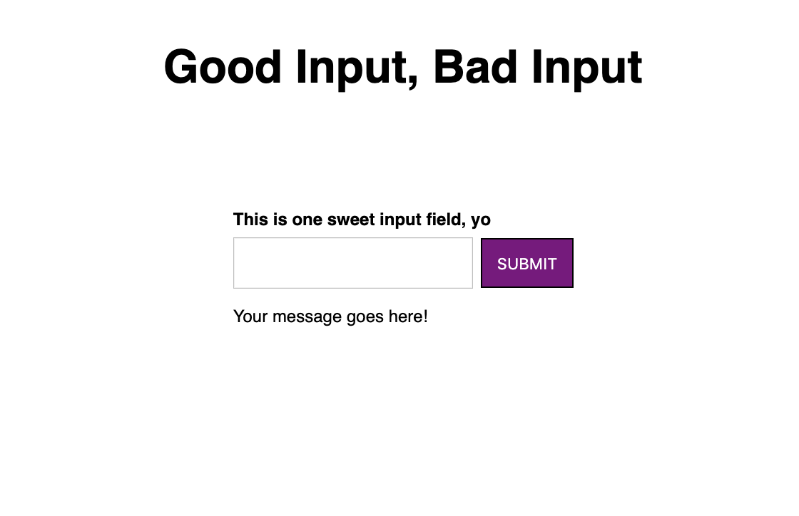

# Good Input, Bad Input

|                     |                                                                           |
| ------------------- | ------------------------------------------------------------------------- |
| **Difficulty**      | Easy / Intermediate                                                       |
| **Completion Time** | ~20-25 minutes for the base exercise, and 5-10 minutes for bonus features |
| **Interview Slot**  | On-site Interview, React (Javascript)                                     |

> Given the base component with an input field and button, add functionality that validates an input field on submission.
>
> A valid input contains "good" within the value:
> e.g. "good vibes only", "goodness", etc.
> An invalid input contains the word "bad" within the value:
> e.g. "too bad", "badminton", etc.
>
> 

## Setup Code (Codesandbox is highly recommended for this set-up)

App.js:

```

import React from "react";
import "./styles.css";
import GoodBadForm from "./good-bad-form";

export default function App() {
  return (
    <div className="App">
      <h1>Good Input, Bad Input</h1>
      <GoodBadForm defaultValue="good to meet you" />
    </div>
  );
}


```

input.jsx:

```

import React from "react";

const GoodBadForm = ({ defaultValue }) => {
  return (
    <div className="center">
      <label>This is one sweet input field, yo</label>
      <div>
        <input />
        <button>submit</button>
      </div>
      <p>Your message goes here!</p>
    </div>
  );
};

export default GoodBadForm;

```

styles.css:

```
.App {
  display: flex;
  flex-direction: column;
  font-family: sans-serif;
}

button {
  background-color: purple;
  border: 1px solid black;
  color: white;
  margin-left: 5px;
  padding: 10px;
  text-transform: uppercase;
}

.center {
  align-self: center;
  display: flex;
  flex-direction: column;
}

h1 {
  padding-bottom: 60px;
  text-align: center;
}

input {
  padding: 10px 20px;
}

label {
  font-size: 12px;
  font-weight: 600;
  padding-bottom: 5px;
}

p {
  font-size: 12px;
  padding-bottom: 20px;
}


```

## Requirements

- A valid input will display: "Good job! This is valid."
- An invalid input will display: "This is really, really bad."
- An input that does not contain "good" or "bad" will be neutral -- there will be no message displayed.
- The initial message passed in from the parent component must be displayed on page load.

## Edge Cases The Candidate Should Consider

- Casing for input (let's say that it is case insensitive)
- What if a string has good and bad in it? (up to interviewer, maybe come up with a third message type or simply don't return any message)
- Catches that the form does not have the <form> tag on it (+1 for adding it & recognizing accesibility issues)

## Bonus Features

If the candidate finishes early, try asking them to do the following:

- make the messages color-coded for their validity (red for invalid, green for valid)
- add a clear button that clears the input field
- make the input field validate as a user is typing

## What We're Testing

- React knowledge - the ability to use state and props, display content dynamically
- A little logic (validating a string)
- Event delegation - handling the onClick (or submit if they catch the no-form) event for the validation, the onChange event for value updating
- ES6 knowledge (spread operator, destructuring)

## Solution

```
const goodRegex = /good/gi;
const badRegex = /bad/gi;

const isGood = val => goodRegex.test(val);
const isBad = val => badRegex.test(val);

const messageMap = {
    good: "Good job! This is valid.",
    bad: "This is really, really bad.",
    neutral: "
};

const GoodBadForm = ({ defaultValue }) => {
  const defaultInput = {
    value: defaultValue,
    validity: "neutral"
  };

  const [inputField, setInputField] = useState(defaultInput);

  const updateValue = value => {
    setInputField({ ...inputField, value });
  };

  const validateField = val => {
    let validity = "neutral";

    if (isGood(val)) {
      validity = "good";
    } else if (isBad(val)) {
      validity = "bad";
    }

    setInputField({ ...inputField, validity });
  };

  const { value, validity } = inputField;

  return (
    <div className="flex-container">
      <label>This is one sweet input field, yo</label>
      <div>
        <input value={value} onChange={e => updateValue(e.target.value)} />
        <p>{messageMap[validity]}</p>
      </div>
      <button onClick={() => validateField(value)}>submit</button>
    </div>
  );
};

```

## Evaluation Criteria

_Regular_

- Is able to complete most of the exercise with some help / guidance
- Communicates throughout the process, asks questions if stuck or asks to look at documentation if needed
- Is able to open the console and debug problems

_Senior+_

- Asks about constraints, edge caeses, or requirements before starting / details and communicates how they will approach the problem
- Some thought into acessibility
- Is able to complete the exercise with minimal or no hints
- Is able to complete one of the bonus features
- More elegant ES6 approach (spread operator to create new state object)
- Functions are clean, input field state object is clean
- Naming conventions for functions & variables have thought put into them

_Nice to have:_

- knowledge of React hooks and using the useState hook appropriately
